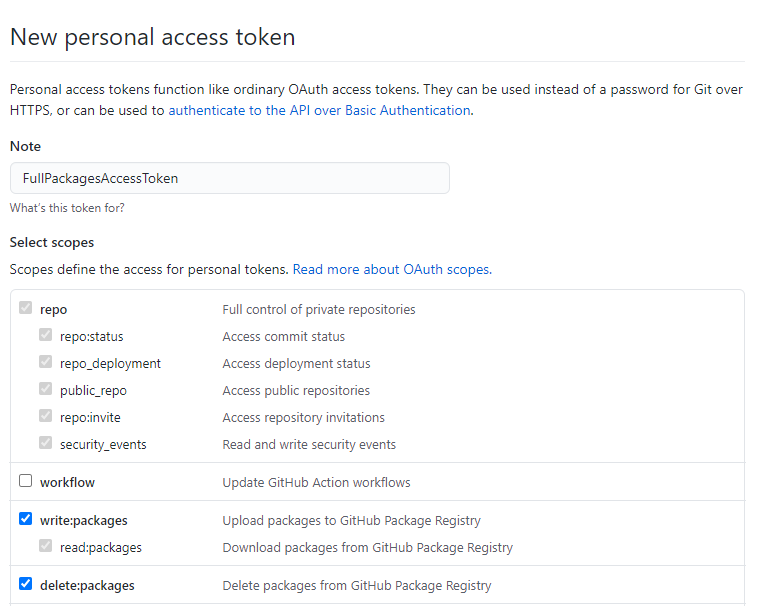

# Publish from local machine

* Create access token in github

* Create ```.npmrc``` in the same folder where ```packge.json``` is located.
  Because this ```.npmrc``` contains secret it should not be pushed to the remote repo so it has to be added to `.gitignore`.

  ```
  @kicaj29:registry=https://npm.pkg.github.com/
  //npm.pkg.github.com/:_authToken=[TOKEN_VALUE]
  ```

* In `package.json` of the library add entry: ```"repository": "git://github.com/kicaj29/github-action-publish-npm.git"```.
  Thx to this package name does not have to match to repository name, more [here](https://docs.github.com/en/packages/working-with-a-github-packages-registry/working-with-the-npm-registry#publishing-multiple-packages-to-the-same-repository).

* Next run
  ```
  cd my-workspace/
  ng build @kicaj29/lib1 --prod
  cd dist/kicaj29/lib1
  npm publish
  ```

# links
https://angular.io/guide/creating-libraries   
https://docs.github.com/en/packages/working-with-a-github-packages-registry/working-with-the-npm-registry

